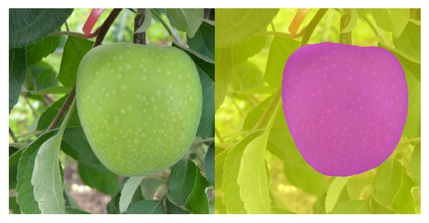

# Central object segmentation by deep learning for fruits and other roundish objects
We present **CROP(Central Roundish Object Painter)**, which identifies and paints the object at the center of an RGB image. Primarily **CROP** works for roundish fruits in various illumination conditions, but surprisingly, it could also deal with images of other organic or inorganic materials, or ones by optical and electron microscopes, although **CROP** was trained solely by 172 images of fruits. The method involves image segmentation by deep learning, and the architecture of the neural network is a deeper version of the original **U-Net**.

arXiv:2008.01251 [cs.CV]:  
[PDF](https://arxiv.org/pdf/2008.01251.pdf), or [Abstract](http://arxiv.org/abs/2008.01251).  

In this project, we developed a non-contact method of measuring the relative size and locating the center of the central roundish objects in images, by counting the corresponding pixels, and identifying the center of mass. Applying this method to images taken by fixed cameras, one can obtain time series data on the growth process of various fruits. For accurate data, **CROP** processes 512×512-pixel images, which can be seen in the examples below (the size was reduced to save the resource). 

## Works for various fruits. 
 
<i>The photos with no masks (left, 512×512 pixels) are the inputs and the ones with masks (right, 512×512 pixels) are the outputs. **CROP** can identify and process the central roundish fruit of various kinds and colors. These examples are independent of the training process. Photo credit: Hideki Murayama.</i>

## Achieved generality. 
 
<i>It can process organic or non-organic roundish objects. The photos with no masks (left, 512×512 pixels) are the inputs and the ones with masks (right, 512×512 pixels) are the outputs. These examples are independent of the training process.</i>

## Reduces measurement errors. 
 
<i>The first figure is the input, and **CROP** identifies the central pear, as at the top-left corner of the next figure. Then, it makes measurements in eleven different scales, which can be seen in the same figure. The histogram shows the outcomes of pixel measurements re-scaled to be compared in the original scale. The pear giving the median is picked as in the last figure. The process is supposed to exclude outliers.</i>

<i>Examples: the target pear during the day of 12 Oct 2020. For each photo, the one giving the median was chosen. The camera was set by Takashi Okuno in the farm of Yota Ozeki.</i>

## Gives time series data.
 
<i>The left boxplot was the outcome of the size measurements during the five days (08-12 Oct 2020); eight photos per day, where each photo was processed in eleven different scales, showing high variance during the night. The right was the plot of positions of the target pear during 12 Aug-15 Oct 2020, with some outliers below the frame. The larger the id is, the later it is.</i>

---
## Using **CROP**. 
Please install Python, PyTorch, Jupyter, Pillow, Matplotlib and then download the following files: `demo.ipynb`, `analysis_single.ipynb`, `analysis_multiple.ipynb`, `source.py` and favorite parameter dictionaries into the same folder, and open these IPython notebooks by Jupyter Notebook, depending on the purposes below. Follow the links for further details. 

## Three different ways of using **CROP**.

- [analyze internet photos.](/demo_internet_images/README.md)

- [analyze individual photos in a directory or folder.](/analysis_single/README.md)

- [analyze time series photos in a directory or folder.](/analysis_timeseries/README.md)

The network dictionaries are placed at [release](https://github.com/MotohisaFukuda/CROP/releases), so you can downlaod and unfreeze them (git-clone is not enough to get ones).
To see the difference between the dictionaries, please have a look at our paper. 

---
The TITAN Xp GPU used in this project was denoted by NVIDIA Corporation.
